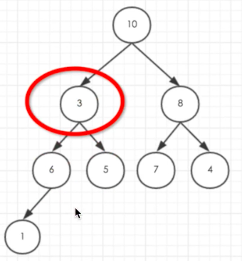
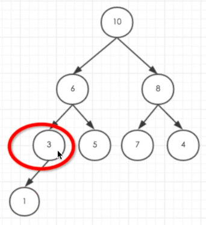
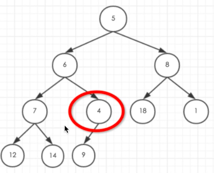
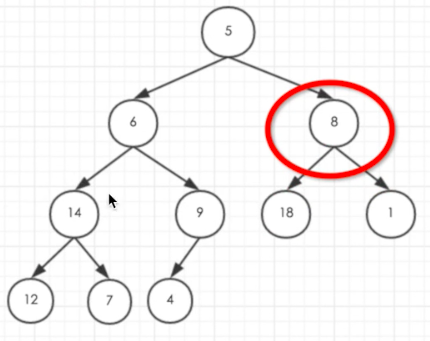

# 数据结构
（看了数据结构相关的视频和书籍自己简化总结的版本）  
## 首先抛出一个问题，什么是数据结构？  
相互之间存在一种或多种特定关系的数据元素的集合  
按照逻辑结构可以分为：集合结构、线性结构、树形结构、图形结构；  
按照物理结构可以分为：顺序存储结构、链接存储结构。 
## 算法的时间复杂度  
大O记法：语句总的执行次数T(n)=O(f(n)),其中f(n)表示问题规模n的某个函数的运行次数  
随着n增大，T(n)增长最缓慢的算法为最优算法  
几种求和算法的时间复杂度：
O(1) 常数阶  
O(n) 线性阶  
O(n^2) 平方阶  
判断一个算法的效率时，函数中的常数项和其他次要项常常可以忽略，更应该关注最高阶项的阶数  
```
推导大O阶的方法：  
1.常数1取代所有常数
2.保留最高阶项
3.去除最高阶项前的常数
```
例：f(n)=3,则O(f(n))=1  
f(n)=11111,则O(f(n))=1  
f(n)=5n^2+100,则O(f(n))=n^2  
常见的时间复杂度所耗时间的大小排列：  
O(1)<O(logn)<O(n)<O(nlogn)<O(n^2)<O(n^3)<O(2^n)<O(n!)<O(n^n)  
## 线性表  
定义：零个或多个数据元素的有限序列  
例如：十二星座  
线性表的操作：初始化，重置，查找，删除等等  
[线性表的基本操作](https://www.cnblogs.com/leaver/p/6832390.html)  
### 线性表的存储结构  

#### 顺序存储结构  

#### 链式存储结构  

## 数组和链表    
数组：连续，定长，不适合做插入删除等操作，可以直接通过下标进行访问  
打个形象的比方，停车场的每一排都可以看做一个数组，定长，连续，如果要插入停车，后面的每辆车都要移动位置，所以不适合做插入，直接追加很快  
python中的list与数组类似，但是长度可变，可视作动态的数组  
链表：不连续，不定长，适合做插入删除等操作，不可以直接通过下标访问（与数组正好相反）  
形象的比方：曲别针  
## 队列和栈  
队列：先进先出，只能从队列末尾插入数据，从队列头部取出数据  
形象的比方：食堂排队打饭  
[用python实现队列](py_queue.py)  
栈：后进先出，从末尾插入数据，从末尾取出数据  
形象的比方：硬币筒  
[用python实现栈](py_stack.py)  
## 树  
计算机科学中的树可以看过倒挂的树，根在上，分支在下  
  
从图中看，1节点就是根节点，从1分叉出了2,3,4节点  
2,3,4是1的孩子节点  
2,3,4互为兄弟节点  
1为2,3,4的父节点  
这棵树的深度为4（一共4层）  
多棵树组成森林  
### 常用的树：二叉树（每个节点最多有2个子节点）  
  
遍历：  
前序遍历（根左右）{1,2,5,6,3,7,8,9}  
中序遍历（左根右）{5,2,6,1,8,7,9,3}  
后序遍历（左右根）{5,6,2,8,9,7,3,1}  
[用python实现二叉树前序遍历](py_tree.py)  
## 排序   
### 插入排序  
类似于打牌时整理手牌的过程  
### 冒泡排序  
第一个和第二个比，大的往后排（或者往前排），以此类推，一直到队尾  
### 快速排序  
最经典的排序方法（体育课排队）  
### 归并排序  
洗牌  
### 二分查找  
幸运52中最后一个环节“猜价格”就是典型的二分查找  
[用python实现二分查找](py_binary_search.py)  
## 堆  
让班主任在班里找出成绩前10的同学，就把班里所有人的成绩排序，然后取前十名。但是如果说要把全省的前十名取出来，难道要对全省的所有人成绩排序？？？堆就是专门用来解决这种问题的  
### 堆的特点：  
1.堆是一个二叉树  
2.叶子节点只存在最下面两层；从根节点到倒数第二层是一个完全二叉树  
3.一个节点不可能只有右孩子  
4.一个节点的左孩子和右孩子都比这个节点大（或者小）
  
### 堆的操作：  
1.维护堆的状态  
     
2.建堆  
  
3.取堆顶（每次把最大值取走，然后把最后一个叶子的值放到堆顶的位置，再采用维护堆状态的方法进行变换）  
   
4.新增数据  
插入数据的同时要满足堆的条件，所以尽量在最后一层往左插  


