# 数据结构
（看了数据结构相关的视频和书籍自己简化总结的版本）  
## 1 首先抛出一个问题，什么是数据结构？  
相互之间存在一种或多种特定关系的数据元素的集合  
按照逻辑结构可以分为：集合结构、线性结构、树形结构、图形结构；  
按照物理结构可以分为：顺序存储结构、链接存储结构。 
## 2 算法的时间复杂度  
大O记法：语句总的执行次数T(n)=O(f(n)),其中f(n)表示问题规模n的某个函数的运行次数  
随着n增大，T(n)增长最缓慢的算法为最优算法  
几种求和算法的时间复杂度：
O(1) 常数阶  
O(n) 线性阶  
O(n^2) 平方阶  
判断一个算法的效率时，函数中的常数项和其他次要项常常可以忽略，更应该关注最高阶项的阶数  
```
推导大O阶的方法：  
1.常数1取代所有常数
2.保留最高阶项
3.去除最高阶项前的常数
```
例：f(n)=3,则O(f(n))=1  
f(n)=11111,则O(f(n))=1  
f(n)=5n^2+100,则O(f(n))=n^2  
常见的时间复杂度所耗时间的大小排列：  
O(1)<O(logn)<O(n)<O(nlogn)<O(n^2)<O(n^3)<O(2^n)<O(n!)<O(n^n)  
## 3 线性表  
定义：零个或多个数据元素的有限序列  
例如：十二星座  
线性表的操作：初始化，重置，查找，删除等等  
[线性表的基本操作](https://www.cnblogs.com/leaver/p/6832390.html)  
### 3.1 线性表的存储结构  
包括顺序存储结构和链式存储结构，链式存储结构包括（单链表，静态链表，双向链表，循环链表）  
#### 3.1.1 顺序存储结构  
通常用数组来实现顺序存储结构,顺序存储结构适合读取数据，不适合做做插入删除等操作，当线性表长度变化较大时，难以确定存储空间的容量    
##### 描述顺序存储结构的三个属性：  
1.存储空间的起始位置  
2.线性表的最大存储容量MaxSize（也就是数组空间的大小）  
3.线性表的当前长度length  
##### 地址的计算方法  
假设当前线性表中有n个元素a1，a2，，，an（对应的下标分别为0，1，，，n-1），线性表中每个数据元素占用的存储单元都是c，已知a1的位置(即地址）为LOC(a1),求任意一元素ai的位置LOC(ai):  
```
LOC(ai) = LOC(a1)+(i-1)*c
```
##### 顺序存储的获得元素、插入、删除基本操作  
获得线性表L中第i个元素的值并返回给e：  
```
#define OK 1
#define ERROR 0
Status GetElem(SqList L,int i,ElemType *e)
{
  if(L.length==0 || i<1 || i>L.length)
    return ERROR;   //（套路代码）满足初始条件：L存在，1=<i<=L.length
  *e = L.data[i-1];
  return OK;
}
```
上述代码的时间复杂度为O(1)  
在线性表L中第i个位置插入新元素e，L的长度加一：  
当出现以下情况时，需要抛出异常：  
1.不满足初始条件：L存在，1=<i<=L.length  
2.线性表长度大于数组长度，线性数据表已满，需要抛出异常或动态增加容量  
思路：当插入的数据在表尾时，直接将下标i-1位置赋值e，L长度加一；当插入的数据不在表尾时，从第i个位置开始到最后一个元素，都要向后移动一个位置  
```
Status InsertList(SqLIst *L,int i,Elemtype e)
{
  int k;//k代表第i个位置及之后的数据元素的下标，用来遍历  
  if(L->length > MAXSIZE)
    return ERROR;
  if(i<1 || i>L->length)
    return ERROR;
  if(i == L->length)
    L->data[i-1]=e;
  if(i <L->length)//遍历最后一个元素到第i个（也就是下标i-1）的元素
  {
    for(k=L->length-1 ; k>=i-1 ; k--)
      L->data[k+1] = L->data[k];
  }
  L->length++;
  return OK;
```
上述代码的时间复杂度为O(n) 
删除线性表L的第i个元素，用e返回其值，L长度减一：  
与插入类似，当出现以下情况时，需要抛出异常：  
1.不满足初始条件：L存在，1=<i<=L.length  
2.线性表为空，即L.length == 0  
思路：当删除的数据在表尾时，直接将下标i-1位置的值给e，L长度减一；当删除的数据不在表尾时，从第i+1个位置开始到最后一个元素，都要向前移动一个位置  
```
Status InsertList(SqLIst *L,int i,Elemtype e)
{
  int k;//k代表第i+1个位置及之后的数据元素的下标，用来遍历  
  if(L->length == 0)
    return ERROR;
  if(i<1 || i>L->length)
    return ERROR;
  if(i == L->length)
    e=L->data[i-1];
  if(i <L->length)//遍历第i+1个（也就是下标i）的元素到最后一个元素，向前移动一个位置
  {
    for(k=i ; k<l->length ; k++)
      L->data[k-1] = L->data[k];
  }
  L->length++;
  return OK;
  ```
  上述代码的时间复杂度为O(n)   
#### 3.1.2 链式存储结构  
链式存储结构适合做插入删除的操作，当线性表中的元素个数变化较大或者不确定长度时，最好用链式存储结构中的单链表结构，这样就不用考虑存储空间的问题了  
链式存储结构包括以下几种：  
单链表：链表的每个结点中只包含一个指针域  
静态链表：用数组描述的链表  
循环链表：首尾相接的单链表  
双向链表：在单链表的每个结点中，再设置一个指向其前驱结点的指针  
我主要记录了单链表的知识点，其他类型的链表有用到再说  
##### 单链表  
明确单链表的定义(结点、指针域(存放指针)、数据域(存放数据信息))  
   
链表头结点的指针域存放头指针，头结点的数据域可以不存储任何信息，也可以存储线性表的长度等附加信息，链表最后一个结点的指针域指向空，用“NULL”或“^”表示  
   
链表结点的数据信息和指针在代码中的表示方法  
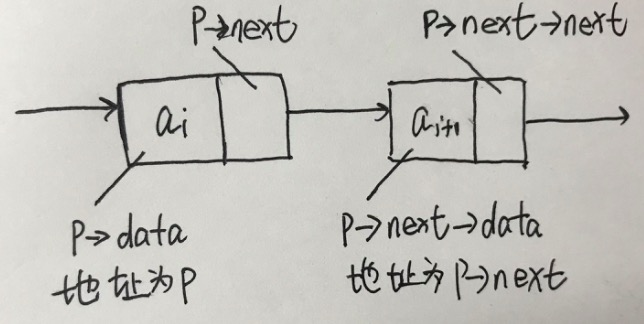   
##### 单链表的读取、插入、删除基本操作  
获得链表第i个数据给e：  
```
Status GetElem(Linklist L,int i,ElemType *e)
{
  int j=1;
  Linklist p = L->next;//定义指针p指向L的第一个结点
  while(p && j<i)
    {
    p=p->next;
    ++j;//j++可以吗？
    }
  if(!p || j>i)
    return ERROR;//第i个结点不存在
  *e = p->data;//取第i个结点的数据  
  return OK;
}
```
在链表L中第i个结点位置之前插入新的数据元素e，L的长度加一：  
```
Status ListInsert(LinkList L,int i,ElemType e)
{
  int j=1;
  Linklist p=L->next;
  LinkList s;
  while(p && j<i)
    {
    p = p->next;
    ++j;
    }
  if(!p || j>i)
    return ERROR;
  s = (LinkList)malloc(sizeof(Node));//生成新结点
  s->data = e;
  s->next = p->next;
  p->next = s;
  L->length++;
  return OK;
}
```
将链表L中第i个结点删除，L的长度减一：  
```
Status ListInsert(LinkList L,int i,ElemType e)
{
  int j=1;
  Linklist p=L->next;
  LinkList s;
  while(p && j<i)
    {
    p = p->next;
    ++j;
    }
  if(!p || j>i)
    return ERROR;
  s=p->next;
  p->next = s->next;
  e = s->data;
  L->length--;
  return OK;
```
##### 单链表的整表创建，整表删除  
单链表整表创建有两种方法：  
头插法：始终把新结点放在头结点后  
随机产生n个元素的值，建立单链表L  
```
void CreatList(LinkList *L,int n)
{
  LinkList p;
  int i;
  srand(time(0));//初始化随机数种子 
  *L=(LinkList)malloc(sizeof(Node));//生成新结点
  (*L)->next = NULL;//头结点指针指向null，建立一个带头结点的单链表
  for (i=0;i<n;i++)
  {
    p=(LinkList)malloc(sizeof(Node));//生成新结点
    p->data = rand()%100+1;//随机生成100以内的数字给数据域
    p->next = (*L)->next;
    (*L)->next = p;
  }
}
```
尾插法：每次生成的新结点都放在终端结点后  
```
void CreatList(LinkList *L,int n)
{
  LinkList p;
  int i;
  srand(time(0));//初始化随机数种子 
  *L=(LinkList)malloc(sizeof(Node));//生成新结点
  LinkList r = *L;//r为指向尾部的结点
  for (i=0;i<n;i++)
  {
    p=(LinkList)malloc(sizeof(Node));//生成新结点
    p->data = rand()%100+1;//随机生成100以内的数字给数据域
    r->next = p;
    r= p;//将当前的新结点定义为尾部结点
  }
  r->next=NULL;//循环结束后让尾部结点置空
}
```
单链表整表删除：  
```
Status ClearList(LinkList *L)
{
LinkList p,s;
p = (*L)->next;
while(p)
  {
    s = p->next;
    free(p);
    p = s;
  }
  (*L)->next=NULL;
  return OK;
}
``` 
## 4 队列和栈  
栈和队列都是特殊的线性表，可以通过顺序存储结构和链式存储结构实现，只不过对插入和删除操作做了限制  
栈：后进先出，限定在表尾进行插入和删除操作    
[用python实现栈](py_stack.py)  
队列：先进先出，只能从队列一端插入数据，从队列另一端删除数据  
[用python实现队列](py_queue.py)  
### 4.1 栈  
#### 4.1.1 栈的定义  
限定仅在表尾进行插入和删除的操作  
栈顶(top)栈底(bottom)后进先出(LIFO结构)  
注意：这里的表尾是指栈顶top而不是栈底  
思考：最先进栈的元素是不是只能最后出栈？不一定  
栈的操作：  
插入（进栈、压、push）  
删除（出栈、弹、pop）  
#### 4.1.2 栈的顺序存储结构实现  
空栈的判定条件：top = -1 
满栈的判定条件：top = MAXSIZE-1  
进栈操作push的实现：插入元素e作为新的栈顶元素  
```
Status Push(SqStack *S, SElemType e)
{
  if(S->top == MAXSIZE-1)//栈满
    return ERROR;
  s->top++;//栈顶指针加一
  s->data[s->top]=e;//新加入元素e赋值给栈顶
  return OK;
}
```
出栈操作pop的实现：若栈不空，删除s的栈顶元素，用e返回值  
```
Status Pop(SqStack *S,SElemType e)
{
  if(S->top == -1)//栈空
    return ERROR;
  e = S->data[S->top];
  S->top--;
  return OK;
}
```
两栈共享空间：  
栈满条件(两个指针之间相差1)：top1+1=top2  
对于两栈共享空间的push和pop操作，需要有一个判断是栈1还是栈2的栈号参数stackNumber  
进栈push：  
```
Status Push(SqDoubleStack *S,SElemType e,int stackNumber)
{
  if(S->top+1==S->top2)
    return ERROR;
  if(int stackNumber==1)
    S->top1++;
    S->data[S->top1]=e;
  elif(stackNumber==2)
    S->top2--;
    S->data[S->top2]=e;
  return OK;
}
```
出栈pop：  
```
Status Pop(SqDoubleStack *S,SElemType e,int stackNumber)
{
  if(stackNumber==1)
  {
    if(S->top1 == -1)
      return ERROR;
    e=S->data[S->top1--];
  }  
  elif(stackNumber==2)
  {
    if(S->top2 == MAXSIZE)//如果栈空对于栈2来说是maxsize
      return ERROR;
    e=S->data[S->top2++];
  }
  return OK;
}
```
#### 4.1.3 栈的链式存储结构实现  
栈的链式存储结构简称“链栈”，如果栈的使用过程中元素变化不可预料最好用链栈，如果变化范围可控最好用顺序栈  
栈顶放在单链表的头部  
对于空栈，top=NULL  
链栈进栈操作：插入元素e为新的栈顶元素,e的新结点为p  
```
Status Push(LinkStack *S,SElemType e)
{
  LinkStackPtr p = (LinkStackPtr)malloc(sizeof(StackNode)):
  p->data=e;
  p->next=S->top;
  S->top=p;
  S->count++;
  return OK;
}
```
链栈出栈操作：删除S的栈顶元素，用e返回  
```
Status Push(LinkStack *S,SElemType e)
{
  LinkStackPtr p = (LinkStackPtr)malloc(sizeof(StackNode)):
  e=S->top->data;
  p=S->top;
  S->top=S->top->next;
  free(p);
  S->count--;
  return OK;
}
```
##### 4.1.4 栈的应用  
1.迭代与递归  
递归函数：一个直接或间接调用自己的函数  
递归函数必须要有终止条件，否则会陷入无穷循环中，消耗内存  
迭代使用的是循环结构，递归使用的是选择结构  
分别用迭代和递归的方法实现打印前40位斐波那契数列：  
斐波那契数列：前面相邻两项之和构成了下一项  
  
```
//迭代
int main()
{
int i;
int a[40];
a[0]=0;
a[1]=1;
printf("%d\n",a[0]);
printf("%d\n",a[1]);
for(i=2;i<40;i++)
  {
    a[i]=a[i-1]+a[i-2];
    printf("%d\n",a[i];
  }
return 0;
}
```
```
//递归
int Fbi(int i)
{
  if(i<2)
    return i==0?0:1;
  return Fbi(i-1)+Fbi(i-2);
}
int main()
{
  int i;
  for(i=0;i<40;i++)
    {
      printf("%d\n",Fbi[i];
    }
  return 0;
}

```
2.四则运算表达式求值  
需要掌握：  
将中缀表达式转换成后缀表达式  
将后缀表达式进行运算得出结果  
具体分析见大话数据结构104-110  
### 4.2 队列  
#### 4.2.1 队列定义  
队尾进，队头出的线性表  
先进先出（FIFO）  
#### 4.2.2 循环队列  
循环队列：头尾相接的顺序存储结构，解决“假溢出”  
引入两个指针，front指针指向队头元素，rear指向队尾元素  
判断队空的条件：front=rear  
判断队满条件：(rear+1)%QueuesSize=front  
通用的计算队列长度的公式：(rear-front+QueuesSize)%QueuesSize  
  
循环队列初始化  
```
Status InitQueue(SqQueue *Q)
{
Q->front=0;
Q->rear=0;
return OK;
}
```
  
求循环队列长度  
```
Status InitQueue(SqQueue Q)
{
  return (Q.rear-Q.front+MAXSIZE)%MAXSIZE;
}
```
  
循环队列的入队列操作  
```
Status EnQueue(SqQueue *Q,QElemType e)
{
  if((Q->rear+1)%MAXSIZE == Q->front)  //队列满
    return ERROR;
  Q->data[Q->rear] = e;
  Q->rear = (Q->rear+1)%MAXSIZE;  //rear指针向后移一位置，若到最后则转到数组头部 
  return OK;
}
```
  
循环队列的出队列操作  
```
Status EnQueue(SqQueue *Q,QElemType e)
{
  if(Q->rear == Q->front)  //队空
    return ERROR;
  e = Q->data[Q->front];
  Q->front = (Q->front+1)%MAXSIZE;  //front指针向后移一位置，若到最后则转到数组头部 
  return OK;
}
```
#### 4.2.3 队列的链式存储结构  
简称链队列  
front指向头结点，rear指向最后一个结点（队尾）  
注意：队头是在头结点后面，也就是front->next,删除元素就是从头结点之后的队头开始删除  
空队列时，rear和front都指向头结点  
在队列Q的队尾插入元素e：  
```
s->data = e;
s->next = NULL;
Q->rear->next = s;
Q->rear = s
```
删除队列Q的队头，用e返回其值：  
```
//设置指针p，用来存放要删除的
p = Q->front->next;
e = p->data;
Q->frint->next = p->next;
free(p);
```
## 5 串  
### 5.1 定义与比较与存储结构  
又叫字符串，零或多个字符组成的有限数列  
s=“a1a2a3......an"(n>=0)  
几个概念：空串，空格串，子串，主串  
子串在主串中的位置就是子串的第一个字符在主串中的序号  
两个字符串的比较大小：例如s=”happ“，t=”happy“，就有s<t;再例如s=”happen“，t=”happy“，前四个字母都相同，但是s的第五个字母e的ASCII码是101，而t的y的ASCII码是121，则e<y，因此s<t  
两个字符串相等：1.长度相等;2.各个对应位置字符串相等  
线性表更关注的是对于单个元素的操作，而字符串更关注的是对于子串的操作，查找子串位置，替换，插入等  
串的存储结构与线性表相同，分为顺序存储结构和链式存储结构，但是链式存储结构不如顺序灵活
### 5.2 朴素模式匹配算法  
简而言之：主串大循环，子串小循环，直到匹配成功，时间复杂度为O((n-m+1)xm)非常低效  
返回子串T在主串S中的第pos个字符后的位置，如果不存在，函数则返回0（假设主串s和要子串T的长度存在S[0]与T[0]中）  
```
int Index(String S, String T, int pos)
{
int i=pos;  //i表示主串s的下标
int j=1;  //j表示子串T的下标
while(i<=S[0] && j<=L[0])
{
  if(S[i]=T[j])  //如果两字母相等则继续遍历
  {
    ++i;
    ++j;
  }
  else
  {
  i=i-j+2;  //否则i退回上次匹配位置的下一位
  j=1;  //j退回T的起始位置
  }
}
if(j>T[0])
  return(i-T[0])
else
  return 0;
}
```
### 5.3 KMP模式匹配算法  
关键：根据子串T和T的当前位置下标j推导next[j]数组  
```
void get_next(string T, int *next)
{
int i=1,j=1;  //T[j]表示前缀的单个字符，T[i]表示后缀的单个字符  
next[1]=0;
while(i<T[0])
{
  if(T[i]==T[j])
  {
    ++i;
    ++j;
    next[i]=j-1;
  }
  else
    j=next[j];
}
}
```

## 6 树  
### 6.1 树的定义  
首先明确几个概念：结点，空树(结点为0)，树，根，子树，森林  
结点的分类：根结点，叶结点（终端结点），分支结点（非终端结点，内部结点），孩子，双亲，祖先，子孙，堂兄弟  
结点拥有的子树数目称为度  
  
从图中看，1结点就是根结点，从1分叉出了2、3、4分支结点，1结点度为3，2、3、4是1的孩子结点，2、3、4互为兄弟结点，1为2、3、4的父结点  
这棵树的深度（高度）为4（一共4层），深度与度要区分开  
### 6.2 树的存储结构  
树的存储结构的三种表示法：双亲表示法，孩子表示法，孩子兄弟表示法  
双亲表示法： data数据域，存储结点的数据信息；parent指针域，存储该结点的双亲在数组中的下标；约定根结点的位置域设置为-1  
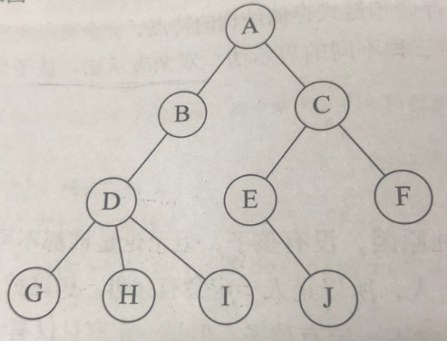  
```
双亲表示法：
下标：    0123456789
data：   ABCDEFGHIJ
parent：-1001223334
```
```
改进的双亲表示法：增加长子域（没有孩子的结点就设置为-1），也可以记录右兄弟的下标rightsib
下标：       0123456789
data：      ABCDEFGHIJ
parent：   -1001223334
firstchild：13469-1-1-1-1-1
```
孩子兄弟表示法的结果就是把一棵复杂的树变成了二叉树，也就是接下来的内容  
### 6.3 二叉树  
  
* 二叉树的特点：  
每个结点最多有两棵子树；  
左子树和右子树有顺序的。  
* 二叉树的五种基本形态：  
空二叉树；  
只有一个根结点；  
根结点只有左子树；
根结点只有右子树；
根结点既有左子树又有右子树。  
* 特殊二叉树：  
斜树（左斜树，右斜树）  
满二叉树  
完全二叉树  
判断满二叉树与完全二叉树的方法：看编号是否连续  
* 二叉树的性质：  
《大话数据结构》p169-p171  
* 二叉树的存储结构：  
顺序存储结构：对于一般的二叉树，可以按照完全二叉树进行编号，把不存在的结点设置为"^",但是这样做显然会造成存储空间的浪费，所以顺序存储结构一般只用于完全二叉树  
链式存储结构（二叉链表）：为每个结点设计一个数据域和两个指针域(data,lchild,rchild)  
如果需要的话，再设置一个指向双亲的指针域，则称之为三叉链表  
* 二叉树的遍历： 
  
前序遍历（根左右）{1,2,5,6,3,7,8,9}  
[用python实现二叉树前序遍历](py_tree.py)  
```
// 前序遍历递归算法
void PreOrderTraverse(BiTree T)
{
  if (T==NULL)
    return;
  printf("%c",T->data);
  PreOrderTraverse(T->lchild);
  PreOrderTraverse(T->rchild);
}
```
中序遍历（左根右）{5,2,6,1,8,7,9,3}  
```
// 中序遍历递归算法
void InOrderTraverse(BiTree T)
{
  if (T==NULL)
    return;
  PreOrderTraverse(T->lchild);
  printf("%c",T->data);
  PreOrderTraverse(T->rchild);
}
```
后序遍历（左右根）{5,6,2,8,9,7,3,1}  
```
// 后序遍历递归算法
void PostOrderTraverse(BiTree T)
{
  if (T==NULL)
    return;
  PreOrderTraverse(T->lchild);
  PreOrderTraverse(T->rchild);
  printf("%c",T->data);
}
```
根据前中后序遍历序列来确定一棵二叉树：  
已知前，中，可以确定；  
已知后，中，可以确定；  
已知前，后，不能。  
* 二叉树的建立  
原二叉树的扩展二叉树：将二叉树中每个结点的空指针引出一个虚结点，用“#”表示  
```
void CreateTree(BiTree *T)
{
  TElemType ch;
  scanf("%c",&ch);
  if(ch=='#')
    *T=NULL;
  else
  {
    *T=(BiTree)malloc(sizeof(BiTNode));
    if(!*T)
      exit(OVERFLOW);
      (*T)->data = ch;
      CreateBiTree(&(*T)->lchild);
      CreateBiTree(&(*T)->rchild);
  }
}
```
* 线索二叉树  
大话数据P188-P194  
### 6.4 树，森林与二叉树的转换  
树转换为二叉树：加线，去线，层次调整；  
森林转换为二叉树：每棵树转化为二叉树，后一棵树的根结点作为前一棵树的右孩子；  
二叉树转换为树：加线，去线，层次调整；  
二叉树转换为森林：右孩子分离，分离后的二叉树转化为树。  
### 6.5 霍夫曼树  
大话数据P203-P207  
## 7 图  
### 7.1 各种图定义  
*   
图G(V,E),G表示一个图，V是图G中顶点的集合，E是图G中边的集合  
*   
线性表中的数据元素叫元素  
树---结点  
图---顶点  
注意：在图结构中，不允许没有顶点  
* 
线性表相邻数据元素之间具有线性关系  
树----层次关系  
图----边关系  
*   
无向图G1=(V1,{E1}),其中顶点集合V1={A,B,C,D};无向边集合E1={(A,B),(B,C),(C,D),(D,A),(A,C)}  
有向图G2=(V2,{E2}),其中顶点集合V2={A,B,C,D};有向边(弧)集合E2={<A,D>,<C,A>,<B,A>,<B,C>}  
<弧头，弧尾>  
*   
无向完全图：任意两个顶点之间都存在边，含有n个顶点的无向完全图有n*(n-1)/2条边  
有向完全图：------------------方向互为相反的两条弧，含有n个顶点的有向完全图有n*(n-1)条弧  
*   
稀疏图与稠密图  
*   
带权的图称为网  
*   
子图  
邻接点  
度（入度，出度）  
路径，路径长度（表示路径上的边或弧的数目）  
回路/环，简单回路/简单环  
* 连通图相关术语  
连通图，强连通图
连通分量，强联通分量  
### 7.2 图的存储结构  
#### 7.2.1 邻接矩阵  
二维数组  
无向图  
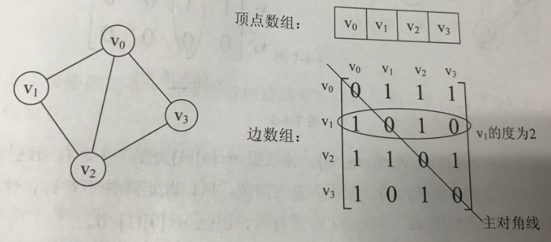  
有向图  
  
带权的有向图（网）  
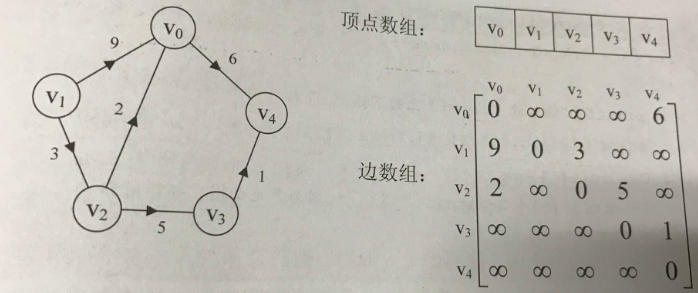  
#### 7.2.2 邻接表  
针对边数相对顶点较少的图，这种结构对存储空间会造成极大浪费  
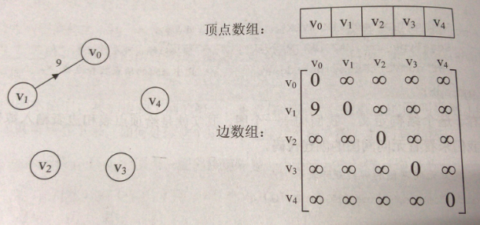  
采用一维数组+链表的存储方式：将顶点存储在一个一维数组中，将顶点的所有邻接点构成一个链表，无向图称为顶点vi的边表，有向图称为顶点vi作为弧尾的出边表  
无向图的邻接表  
  
有向图的邻接表和逆邻接表  
  
带权值网图的邻接表  
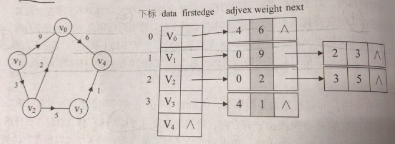  
#### 7.2.3 十字链表  
对于有向图，邻接表能看到出度，逆邻接表能看到入度，十字链表就是将邻接表与逆邻接表结合起来  
顶点结构：data，firstin，firstout  
边表结构：trailvex，headvex，headlink,taillink  
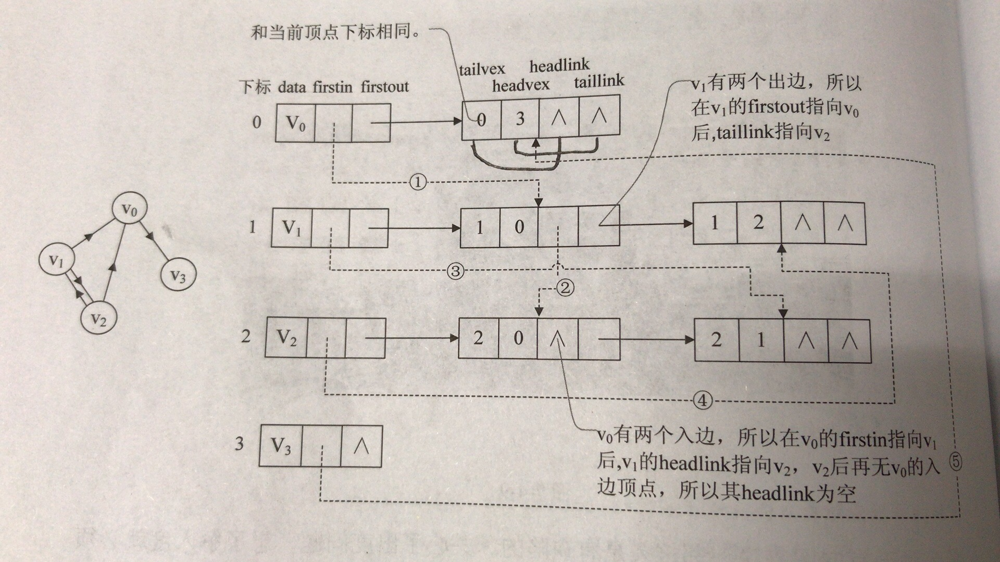  
图中虚线代表逆邻接表，实线代表邻接表  
#### 7.2.4 邻接多重表  
针对无向图，如果关注顶点的操作可以用邻接表，如果更关注边的操作，可以用邻接多重表  
  
#### 7.2.5 边集数组  
边集数组由两个一维数组构成，一个存储顶点的信息，另一个存储边的信息，更适合对边进行的操作  
  
### 7.3 图的遍历  
通常有两种遍历方案，深度优先遍历（depth first search）DFS，广度优先遍历（breadth first search）BFS  
DFS适合目标明确，以找到目标为目的的情况，广度优先适合在不断扩大遍历范围时找到相对最优解的情况  
### 7.4 最小生成树  
典型案例：工程师在村庄间假设通信网络  
构造连通网的最小生成树的两种经典算法，prim算法和kruskal算法  
#### 7.4.1 prim算法  
#### 7.4.1 kruskal算法  
prim算法适合稠密图，kruskal算法适合稀疏图  
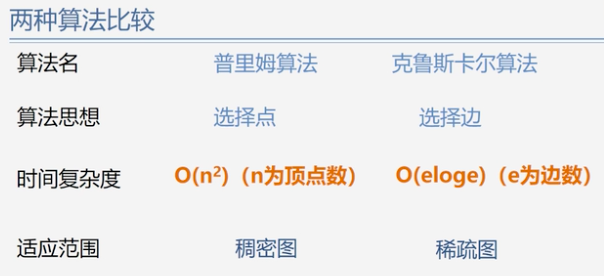  
### 7.5 最短路径  
典型案例：从出发地a到目的地b  
dijkstra算法和floyd算法  
#### 7.5.1 dijkstra算法-单源最短路径  
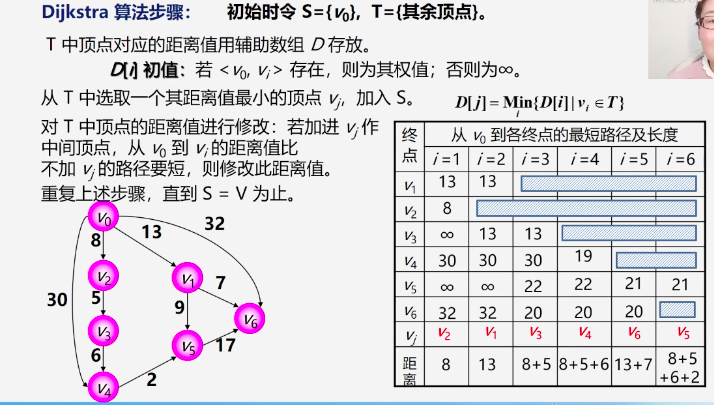  
求一个源点到其他所有顶点的最短距离，dijkstra算法的时间复杂度为O(n^2)，如果要求所有顶点之间的最短距离？则以每一个顶点作为源点，对每一个顶点都执行dijkstra算法，时间复杂度为O(n^3),这是一种方法，另一种方法就是用下面要说的floyd算法  
#### 7.5.2 floyd算法-所有顶点间的最短路径  
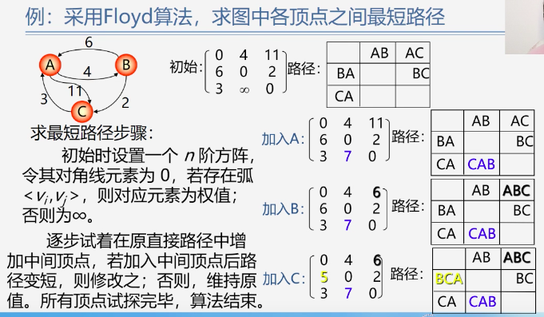  
### 7.6 拓扑排序  
最小生成树和最短路径问题都属于有环图的应用  
典型案例：生活中的电影制作，施工过程，排课，这样的工程图属于无环的有向图，用AOV网来表示  
注意：在AOV网中不能存在回路  
明确几个概念：前驱，后继，直接前驱，直接后继  
问题：如何判断AOV网中是否有环（回路）？  怎样排课？要解决这些问题就要用到拓扑排序  
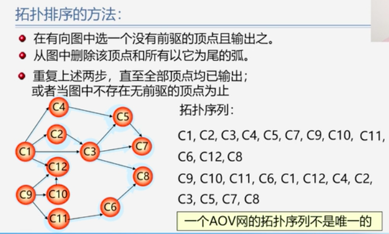  
如果网中所有顶点都在它的拓扑有序序列中，则不存在环  
### 7.7 关键路径  
拓扑排序是为了解决一个工程能否顺利进行的问题，有时还需要解决工程完成需要的最短时间问题  
典型案例：造汽车  
在AOV网的基础上，用边上的权值来表示活动的持续时间，称之为AOE网  
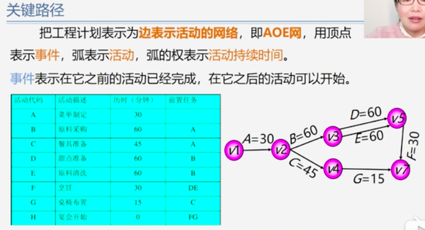  


## 排序   
### 插入排序  
类似于打牌时整理手牌的过程  
### 冒泡排序  
第一个和第二个比，大的往后排（或者往前排），以此类推，一直到队尾  
### 快速排序  
最经典的排序方法（体育课排队）  
### 归并排序  
洗牌  
### 二分查找  
幸运52中最后一个环节“猜价格”就是典型的二分查找  
[用python实现二分查找](py_binary_search.py)  
## 堆  
让班主任在班里找出成绩前10的同学，就把班里所有人的成绩排序，然后取前十名。但是如果说要把全省的前十名取出来，难道要对全省的所有人成绩排序？？？堆就是专门用来解决这种问题的  
### 堆的特点：  
1.堆是一个二叉树  
2.叶子节点只存在最下面两层；从根节点到倒数第二层是一个完全二叉树  
3.一个节点不可能只有右孩子  
4.一个节点的左孩子和右孩子都比这个节点大（或者小）
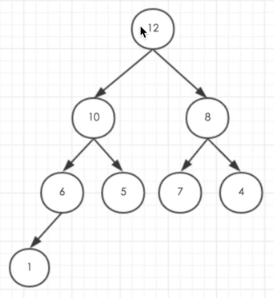  
### 堆的操作：  
1.维护堆的状态  
     
2.建堆  
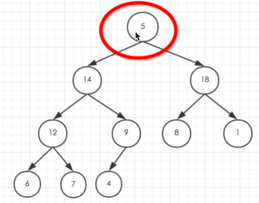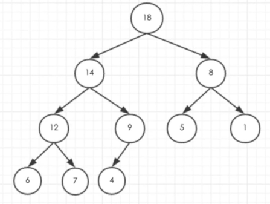  
3.取堆顶（每次把最大值取走，然后把最后一个叶子的值放到堆顶的位置，再采用维护堆状态的方法进行变换）  
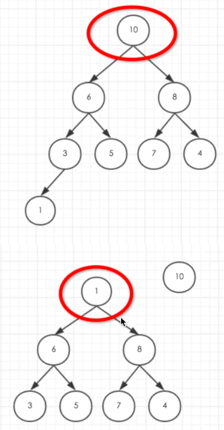   
4.新增数据  
插入数据的同时要满足堆的条件，所以尽量在最后一层往左插  


